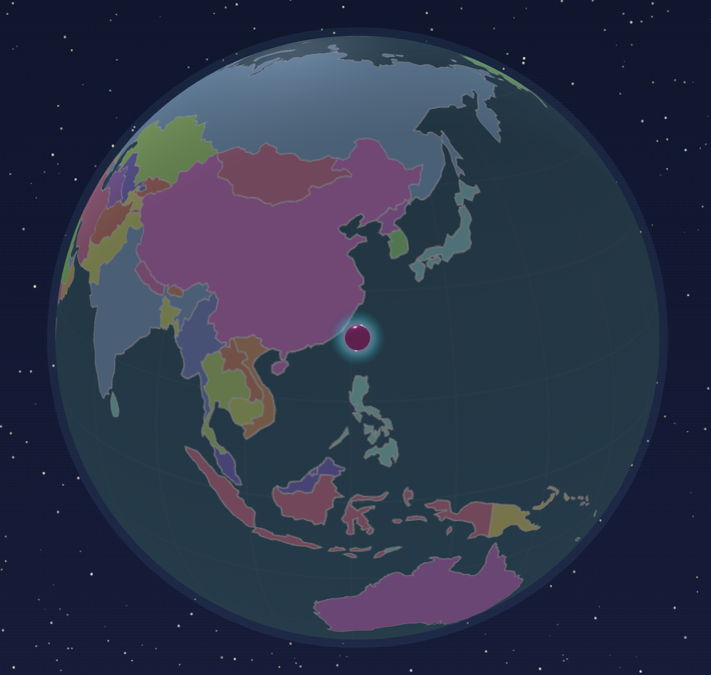
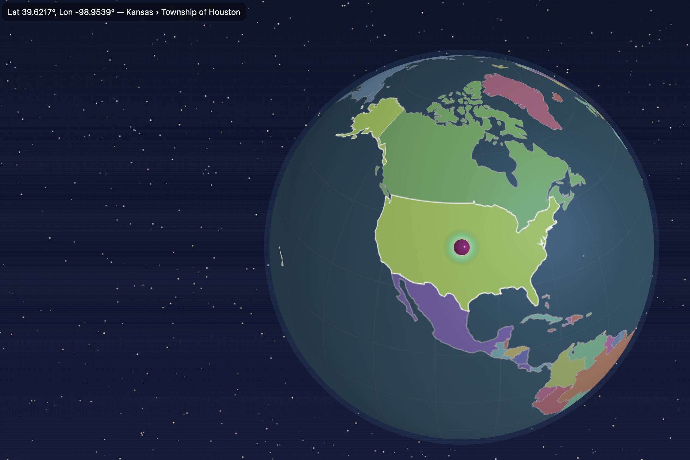
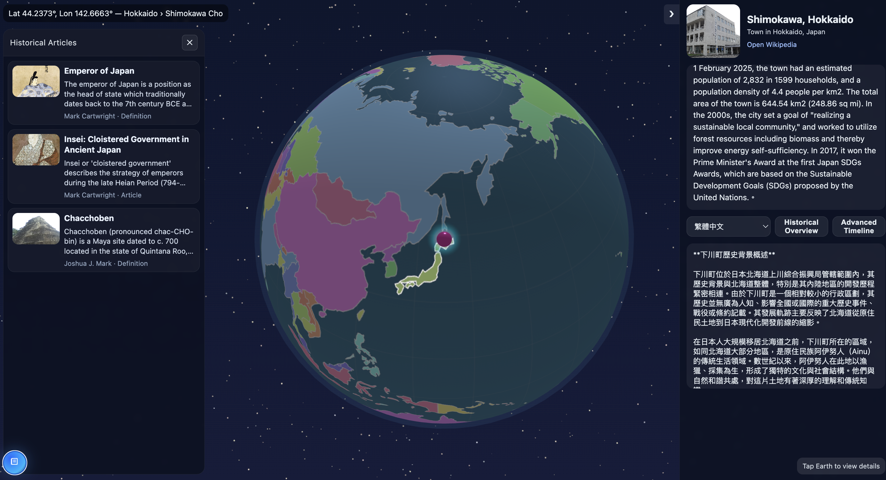

# 🌍 Time Globe

**Time Globe** is an interactive globe application that lets you explore **geographical data, historical background, and temporal knowledge** from around the world.
Click anywhere on Earth and instantly retrieve **Wikipedia summaries, AI-generated historical insights, and curated articles from [WorldHistory.org](https://www.worldhistory.org/).**

It’s more than a map — it’s a **gateway through space and time**.

---

## 🚀 Quick Start

### 1. Clone the repository

```bash
git clone git@github.com:Lucien1999s/time-globe.git
cd time-globe
```

### 2. Create your `.env` file

Inside the project root, add a `.env` file with your API keys:

```ini
GEMINI_TOKEN=your_gemini_api_key_here
OPENAI_API_KEY=your_openai_api_key_here
```

* Get a **Gemini API Key**: [Google AI Studio](https://aistudio.google.com/app/apikey)
* Get an **OpenAI API Key**: [OpenAI Platform](https://platform.openai.com/api-keys)

### 3. Launch with Docker Compose

```bash
docker compose up --build -d
```

Visit **[http://localhost:8000](http://localhost:8000)** to start exploring 🌍

---

## ✨ Features & Demo

### Interactive Globe

Spin, drag, and zoom the Earth in real-time.
Click anywhere to drop a glowing pin and fly smoothly to that location.



---

### Local Place Info

Clicking on the globe reveals:

* Latitude / Longitude
* Reverse-geocoded **City, State/Province, and Country**



---

### Knowledge Card

The right-hand info card displays:

* **Wikipedia Summary & Image**
* **Direct Wikipedia link** for further reading
* **Historical Overview** → AI-generated local history
* **Advanced Timeline** → richer, more detailed events with multilingual options

---

### Historical Articles

A floating **book icon** (bottom-left) opens a panel of related historical articles from
[WorldHistory.org](https://www.worldhistory.org/).



---

## 🛠️ Tech Stack

* **Frontend:** Three.js (globe rendering), vanilla JS, CSS
* **Backend:** FastAPI (Python) + Uvicorn
* **Integrations:** Wikipedia, Gemini, OpenAI, WorldHistory.org
* **Deployment:** Docker & Docker Compose

---

## 📜 License

MIT — free to use, modify, and explore the world. Lucien Lin🌌
